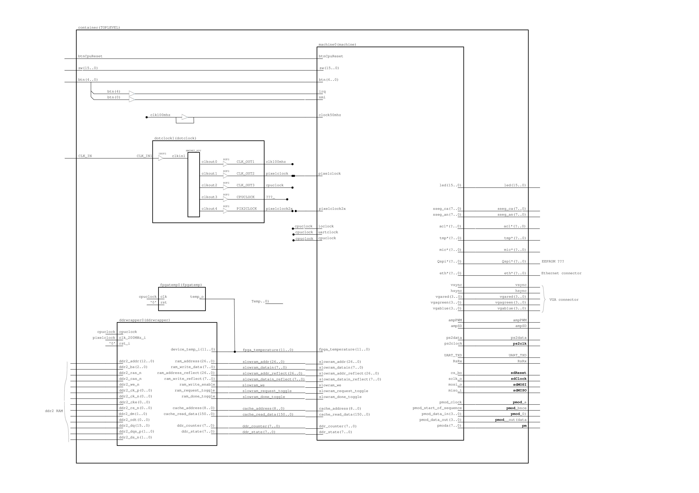

## This is the **structural** documentation file.

# Table of Contents:

[Introduction](#Introduction)

[container](#container)

## Introduction

This page will give an overview of *some* of the components, especially the components at the upper levels. For lower-level components, it is recommended that state-machine diagrams or data-flow diagrams be used.

Contributors: please order the components within this file as they appear in Xilinx ISE.

## container
the toplevel component within the fpga design

48MHz clock comes in, is buffered and fed to a CLKDLL
the CLKDLL outputs four clock signals that are used within the design

clk_out0 - designed to be 48MHz

clk_out1 - designed to be 24MHz

The [DDRcontroller](#DDRcontroller] component is currently not working. Its function is to provide access between the external DDR3-ram chip and the internal 'machine' component.

The machine component holds the significant rest of the architecture.

Other 'logic' includes signal routing, input debouncing, etc.

The End.
